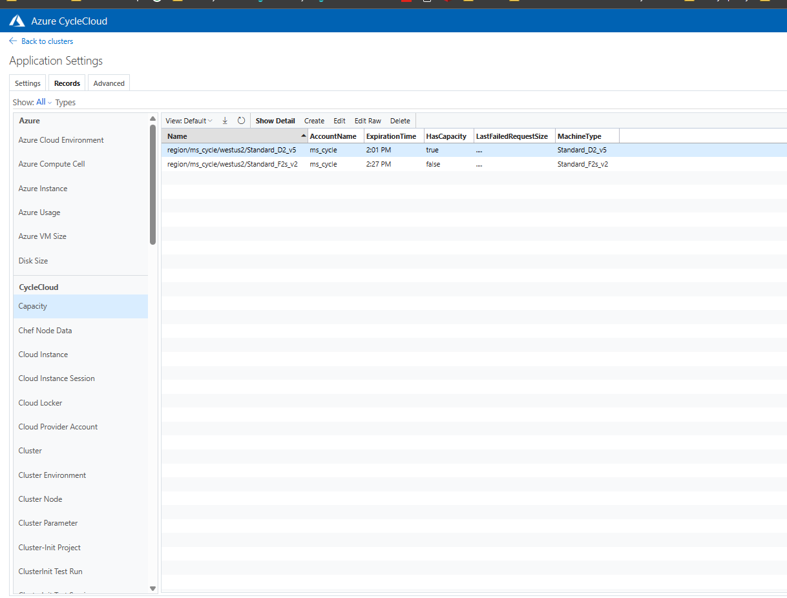

# IBM Spectrum Symphony #

This project installs and configures IBM Spectrum Symphony.

Use of IBM Spectrum Symphony requires a license agreement and Symphony binaries obtained directly 
from [IBM Spectrum Analytics](https://www.ibm.com/us-en/marketplace/analytics-workload-management).


NOTE:
Currently, this project only supports Linux-only Symphony clusters.  Windows workers are not yet supported.

<!-- markdown-toc start - Don't edit this section. Run M-x markdown-toc-generate-toc again -->

**Table of Contents**

- [IBM Spectrum Symphony](#ibm-spectrum-symphony)
    - [Pre-Requisites](#pre-requisites)
    - [Configuring the Project](#configuring-the-project)
    - [Deploying the Project](#deploying-the-project)
    - [Importing the Cluster Template](#importing-the-cluster-template)
    - [Using the Project Specs in Other Clusters](#using-the-project-specs-in-other-clusters)

<!-- markdown-toc end -->


## Pre-Requisites ##

This project requires running Azure CycleCloud version 7.7.1 and Symphony 7.2.0 or later.

This project requires the following:

  1. A license to use IBM Spectrum Symphony from [IBM Spectrum Analytics](https://www.ibm.com/us-en/marketplace/analytics-workload-management).  
  
  2. The IBM Spectrum Symphony installation binaries.
  
     a. Download the binaries from [IBM](https://www.ibm.com/us-en/marketplace/analytics-workload-management) and place them in the `./blobs/symphony/` directory.
     
     b. If the version is not 7.3.0.0 (the project default), then update the version number in the Files list
        in `./project.ini` and in the cluster template: `./templates/symphony.txt`
     
  3. CycleCloud must be installed and running.

     a. If this is not the case, see the [CycleCloud QuickStart Guide](https://docs.microsoft.com/en-us/azure/cyclecloud/quickstart-install-cyclecloud) for
        assistance.

  4. The [CycleCloud CLI](https://docs.microsoft.com/en-us/azure/cyclecloud/install-cyclecloud-cli) must be installed and configured for use.
  
     a. If this is not the case, see the [CycleCloud CLI Install Guide](https://docs.microsoft.com/en-us/azure/cyclecloud/install-cyclecloud-cli) for
        assistance.


## Configuring the Project ##


The first step is to configure the project for use with your storage locker:

  1. Open a terminal or Azure Cloud Shell session with the CycleCloud CLI enabled.
  
  1. Clone this repo into a new directory and change to the new directory:

``` bash

   $ git clone https://github.com/Azure/cyclecloud-symphony.git
   $ cd ./cyclecloud-symphony
   
```
  3. Download the IBM Spectrum Symphony installation binaries and license entitlement file from [IBM](https://www.ibm.com/us-en/marketplace/analytics-workload-management) and place them in the `./blobs/symphony` directory.
    * ./blobs/symphony/sym-7.3.0.0.exe
    * ./blobs/symphony/sym-7.3.0.0_x86_64.bin
    * ./blobs/symphony/sym_adv_entitlement.dat
    
      Or, if using an eval edition:
      
    * ./blobs/symphony/sym_adv_ev_entitlement.dat
    * ./blobs/symphony/symeval-7.3.0.0_x86_64.bin
    * ./blobs/symphony/symeval-7.3.0.0.exe
    
  4. If the version number is not 7.3.0.0, update the version numbers in [`project.ini`](project.ini) and [`templates/symphony.txt`](templates/symphony.txt) 


## Deploying the Project ##


To upload the project (including any local changes) to your target locker, run the
`cyclecloud project upload` command from the project directory.  The expected output looks like
this:

``` bash

   $ cyclecloud project upload my_locker
   Sync completed!

```


**IMPORTANT**

For the upload to succeed, you must have a valid Pogo configuration for your target Locker.


## Importing the Cluster Template ##


To import the cluster:

 1. Open a terminal session with the CycleCloud CLI enabled.

 2. Switch to the Symphony directory.

 3. Run ``cyclecloud import_template symphony -f templates/symphony.txt``.
    The expected output looks like this:
    
    ``` bash
    
    $ cyclecloud import_template symphony -f templates/symphony.txt
    Importing template symphony....
    ----------------
    symphony : *template*
    ----------------
    Keypair: $Keypair
    Cluster nodes:
        master: off
    Total nodes: 1
    ```


## Host Factory Provider for Azure CycleCloud

This project extends the Symphony Host Factory with an Azure CycleCloud resource provider: azurecc.

The Host Factory will be configured as the default autoscaler for the cluster.

### Installing the azurecc HostFactory

It is also possible to configure an existing Symphony installation to use the `azurecc` HostFactory to 
burst into Azure.

Please contact azure support for help with this configuration.


# Guide for using Static Templates with HostFactory

 Follow below steps if you are not using the chef in project:
   1. Copy cyclecloud-symphony-pkg-{version}.zip to /tmp directory in master node.
   2. Unzip the file in /tmp directory
   3. Ensure python3 is installed
   4. You should have following environment variables set as per your environment otherwise install.sh script under hostfactory/host_provider directory take default values:
    EGO_TOP
    HF_TOP
    HF_VERSION
    HF_CONFDIR
    HF_WORKDIR
    HF_LOGDIR
    You can run install.sh within the folder and it will install python virtual environment at
    plugin path like below:
    $HF_TOP/$HF_VERSION/providerplugins/azurecc/scripts/venv
    If you also need to generate symphony configuration then you can run install.sh with argument generate_config and other required arguments. This will set all the configurations assuming you have only azurecc provider and enable it.Example:
    ./install.sh generate_config --cluster <cluster_name> --username <username> --password <password> --web_server <webserver>


## Guide to using scripts

 These scripts can be found under $HF_TOP/$HF_VERSION/providerplugins/azurecc/scripts. 
   1. generateWeightedTemplates.sh 
      This script is used to generated weighted template. You need to run this script as root.
      ./generateWeightedTemplates.sh
      This will create a template based on current cyclecloud template selections and print it.
      If there are errors please check in /tmp/template_generate.out
      You must then store template in $HF_TOP/$HF_VERSION/hostfactory/providers/conf/azurecc_templates.json file. After storing the file the change will take effect only after you stop and start HostFactory.
   2. testDryRunWeightedTemplates.sh 
      These are test scripts which has 2 options:
         a. validate_templates - this will check the template in default path where azurecc_templates.json is stored
            ./testDryRunWeightedTemplates.sh validate_templates
         b. create_machines - for this you need to pass input json as an example:
             input.json:
             {"template": {"machineCount": 205, 
                         "templateId": "execute"},
               "dry-run": true}
             ./testDryRunWeightedTemplates.sh create_machines input.json
             This will not create machines but show what machines would have been created with given input. Make sure "dry-run" is true.


## Testing capacity issues

You can trigger a capacity issue using following python script. 
Run LastFailureTime.py under hostfactory/host_provider/test/ with follwing arguments:
   1. Number of seconds before current time
   2. Account name
   3. region
   4. machine name
Update the offset compared to UTC time to match the time cycle_server is in, like below matches Central US Standard time, that is 5 hrs behind UTC:
   def format_time(timestamp):
    return datetime.datetime.strftime(timestamp, "%Y-%m-%d %H:%M:%S.%f-05:00")
python LastFailureTime.py 1 <AccountName> westus2 Standard_D8_v5

Output is like below:

AdType = "Cloud.Capacity"
ExpirationTime = `2024-03-01 16:34:54.045927-06:00`
AccountName = "<AccountName>"
StatusUpdatedTime = `2024-03-01 15:34:53.045927-06:00`
Region = "westus2"
HasCapacity = False
Provider = "azure"
Name = "region/<AccountName>/westus2/Standard_D8_v5"
MachineType = "Standard_D8_v5"

Above output is stored in /tmp/test.dat file and run below command to update the Cloud.Capacity record

curl -k -u ${CC_USER} -X POST -H "Content-Type:application/text" --data-binary "@/tmp/test.dat" localhost:8080/db/Cloud.Capacity?format=text

You can also verify this on CC GUI, HasCapacity is false


Note: You should run this script from machine where Cyclecloud is installed.
## Additional configs for symphony templates

Following configuration options:

1. `symphony.enable_weighted_templates` (default: `true`)
   - Used to generate templates where `templateId` corresponds to the nodearray and `vmTypes` are in a dictionary format with weights.
   - You can change this in the Symphony configuration for the master node. In that case, use the default format of `templateId` as `nodearray+sku name`.

2. `symphony.ncpus_use_vcpus` (default: `true`)
   - If `true`, the slot `ncpu` attribute is based on vCPU count.
   - You can change this in the Symphony configuration for the master node.

3. `cyclecloud.capacity_limit_timeout` (default: `300` seconds)
   - The time (in seconds) after which scalelib will wait before making the next allocation attempt after a failure occurs.

4. `symphony.autoscaling.strategy` (default: `price`)
    - Options: `["price", "capacity", "weighted"]`
    - **Price**
       - Uses the legacy allocation algorithm.
    - **Capacity**
       - Allocates cores evenly across all SKUs from the start.
       - Quickly identifies and eliminates SKUs with low capacity.
       - Reduces spikes of single SKUs that may be evicted during allocation.
    - **Weighted**
       - Assigns a preference to each SKU, but still allocates VMs from multiple SKUs in each pass to reduce spikes.
       - When the first SKU runs out of capacity, the distribution shifts to the next SKU for the next allocation.
       - If all SKU preferences/percentages are identical, this behaves the same as the Capacity strategy.

5. `symphony.autoscaling.ncpus` (default: `1`)
   - Number of vCPUs to use for autoscaling slot size

6. `symphony.autoscaling.ncores` (default: `1`)
   - Number of physical cores to use for autoscaling slot size.

7. `symphony.autoscaling.nram` (default: `4096` MB)
   - Amount of RAM (in MB) to use for autoscaling slot size.

8. `symphony.autoscaling.percent_weights` (default: `[0.7, 0.2, 0.05, 0.05]`)
   - List of percentage weights (as fractions) used for the weighted autoscaling strategy.
   - By default, these weights allocate VMs to the top 4 SKUs in a node array, prioritizing higher-capacity SKUs.
   - You can adjust both the values and the number of weights to match your available SKUs and desired distribution.
   - The order and length of this list should correspond to the order and number of VM types you want to distribute across.

# Contributing

This project welcomes contributions and suggestions.  Most contributions require you to agree to a
Contributor License Agreement (CLA) declaring that you have the right to, and actually do, grant us
the rights to use your contribution. For details, visit https://cla.microsoft.com.

When you submit a pull request, a CLA-bot will automatically determine whether you need to provide
a CLA and decorate the PR appropriately (e.g., label, comment). Simply follow the instructions
provided by the bot. You will only need to do this once across all repos using our CLA.

This project has adopted the [Microsoft Open Source Code of Conduct](https://opensource.microsoft.com/codeofconduct/).
For more information see the [Code of Conduct FAQ](https://opensource.microsoft.com/codeofconduct/faq/) or
contact [opencode@microsoft.com](mailto:opencode@microsoft.com) with any additional questions or comments.
